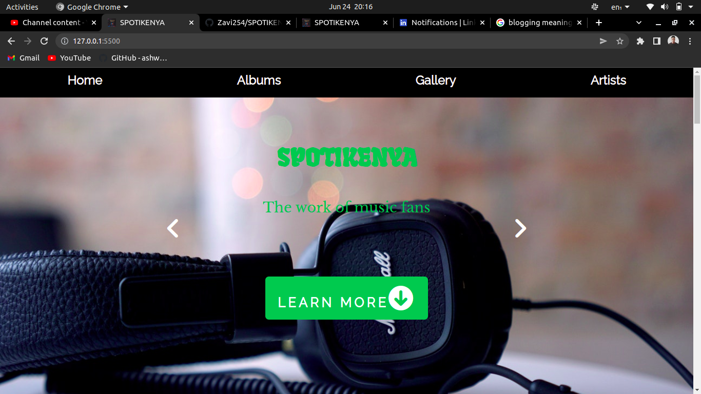
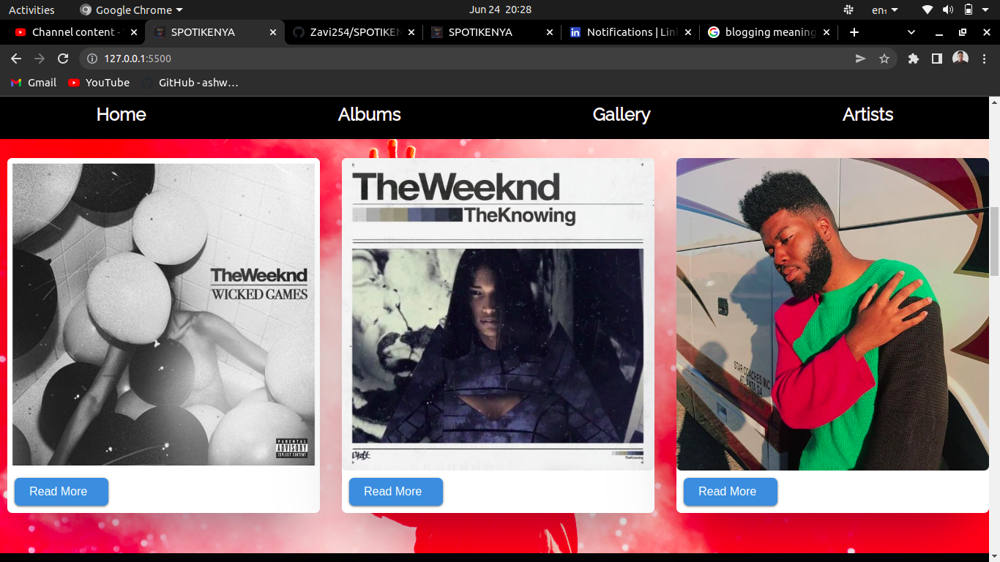

# Project Name
 ## SPOTIKENYA

# AUTHOR
Steven Otiang'a Otieno

## Description
  Spotikenya is a music web application used to list your favorite artists and life history about them, and the albums and music they have created.
  
# Screenshots
  ### Home Page Image
  
  
  ### Albums Page Image
  
  
# Features

  - Home Section Page
  - User Friendly UI Design
  - Album Section
  - Artists Search Section
  - Easy Navigation of the Website

# Technologies Used
  - HTML
  - CSS
  - Javascript
  - AudioDB API
  
# Installation and Setup Instructions
 ### Requirements
  - A Web Browser
  - A Text Editor(Visual Studio Code / Sublime Text)
  - An Internet Connection
  
  
### Setup Instructions
  - Clone the repository.
  `git clone https://github.com/Zavi254/SPOTIKENYA.git`
  - Open the folder in your local machine in visual studio code
  - Click the open with Live Server in Visual Studio Code
  - You are now able to use the web application in your machine
  
# Live Link to the Web Application
  [https://zavi254.github.io/SPOTIKENYA](https://zavi254.github.io/SPOTIKENYA/)
  
# Authors Info
  [LinkedIn](https://www.linkedin.com/in/steven-otieno-6684431b3/)
  
# License

  Copyright (c) 2022 Steven Otieno

Permission is hereby granted, free of charge, to any person obtaining a copy of this software and associated documentation files (the "Software"), to deal in the Software without restriction, including without limitation the rights to use, copy, modify, merge, publish, distribute, sublicense, and/or sell copies of the Software, and to permit persons to whom the Software is furnished to do so, subject to the following conditions:

The above copyright notice and this permission notice shall be included in all copies or substantial portions of the Software.

THE SOFTWARE IS PROVIDED "AS IS", WITHOUT WARRANTY OF ANY KIND, EXPRESS OR IMPLIED, INCLUDING BUT NOT LIMITED TO THE WARRANTIES OF MERCHANTABILITY, FITNESS FOR A PARTICULAR PURPOSE AND NONINFRINGEMENT. IN NO EVENT SHALL THE AUTHORS OR COPYRIGHT HOLDERS BE LIABLE FOR ANY CLAIM, DAMAGES OR OTHER LIABILITY, WHETHER IN AN ACTION OF CONTRACT, TORT OR OTHERWISE, ARISING FROM, OUT OF OR IN CONNECTION WITH THE SOFTWARE OR THE USE OR OTHER DEALINGS IN THE SOFTWARE.
  